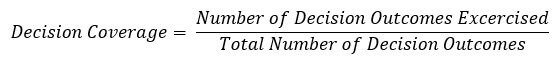
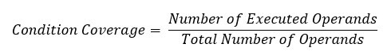

.. _unittest:

unittest and pytest
==========================================

:Author: RYefccd
:Date: 2019-08-15T09:41:59.179550+08:00

测试
-----------------------------------------

|  IEEE定义:
   使用人工或自动的手段来运行或测定某个软件系统的过程，其目的在于检验它是否满足规定的需求或弄清预期结果与实际结果之间的差别。

|  这个定义明确指出:软件测试的目的是为了检验软件系统是否满足需求。

|  我们日常的测试希望保证新功能不会影响旧的逻辑， 旧的代码逻辑修改不会干扰新的流程。 加之我们的数据库中的配置项众多， 接口测试难以覆盖我们新添加的代码， 也难以确定对旧的功能的影响范围。
   针对这种情况， 我们推进单元测试中的测试覆盖， 来满足我们日益严峻的质量要求。 

单元测试
^^^^^^^^^^^^^^^^^^^^^^^^^^^^^^^^^^^^^^^^^^^

|  以下面这段代码作为例子来说明不同的覆盖测试策略。

..    :emphasize-lines: 6

.. code-block:: python
   :linenos:

   def my_demo_func(a, b):
       tmp = []
       if a > 6 and b > 9:
           tmp.append("F")
       else:
           tmp.append("T")
       print(tmp)

语句覆盖(Statement Coverage)
""""""""""""""""""""""""""""""""""""""""""""""""

|  Statement coverage is a white box test design technique which involves execution of all the ``executable statements`` in the source code at least once. It is used to calculate and
   measure the number of statements in the source code which can be executed given the requirements.
|
|  Statement coverage is used to derive scenario based upon the structure of the code under test.

传入参数 a, b。 观察语句覆盖情况。

- 假设给定 a=7, b=10, 代码执行覆盖如下:

  .. code-block:: python
     :linenos:
     :emphasize-lines: 1-4, 7

     def my_demo_func(a, b):
         tmp = []
         if a > 6 and b > 9:
             tmp.append("F")
         else:
             tmp.append("T")
         print(tmp)

  Statement Coverage: 5/7 = 71%

|  What is covered by Statement Coverage?

1. Unused Statements
#. Dead Code
#. Unused Branches

判定覆盖(Decision Coverage)
""""""""""""""""""""""""""""""""""""""""""""""""

|  Decision coverage reports the true or false outcomes of each ``Boolean expression``. In this coverage, expressions can sometimes get complicated. Therefore, it is very hard to achieve 100% coverage.

对 ``a > 6 and b > 9`` 整个 Boolean expression 构造整体表达式为真或者为假的判定逻辑。

- 假设给定 a=7, b=10, 代码执行覆盖如下: (``a > 6 and b > 9`` is True)

  .. code-block:: python
     :linenos:
     :emphasize-lines: 1-4, 7

     def my_demo_func(a, b):
         tmp = []
         if a > 6 and b > 9:
             tmp.append("F")
         else:
             tmp.append("T")
         print(tmp)

  Statement Coverage: 5/7 = 71%

- 假设给定 a=1, b=10, 代码执行覆盖如下:(``a > 6 and b > 9`` is False)

  .. code-block:: python
     :linenos:
     :emphasize-lines: 1-3, 5-7

     def my_demo_func(a, b):
         tmp = []
         if a > 6 and b > 9:
             tmp.append("F")
         else:
             tmp.append("T")
         print(tmp)

  Statement Coverage: 6/7 = 85%

分支覆盖(Branch Coverage)
""""""""""""""""""""""""""""""""""""""""""""""""

|  In the branch coverage, every outcome from a code module is tested. For example, if the outcomes are binary, you need to test both True and False outcomes.
|  
|  It helps you to ensure that every possible branch from each decision condition is executed at least a single time.
|
|  By using Branch coverage method, you can also measure the fraction of independent code segments. It also helps you to find out which is sections of code don't have any branches.
|
|The formula to calculate Branch Coverage:

.. image:: examples/102518_1122_CodeCoverag13.jpg

|  分支覆盖就是构造的测试逻辑覆盖到了每一个条件判断的分支。(if-elif-else)
|  在这个例子中, 分支覆盖和上面的判定覆盖等价. 如果是有多个 if-elif-else 逻辑的话, 如下所示, 就有三个分支,两个判定需要覆盖。

.. code-block:: python
   :linenos:
   :emphasize-lines: 3, 5, 7

   def my_demo_func(a, b):
       tmp = []
       if a > 6 and b > 9:
           tmp.append("F")
       elif: a > 2:
           pass
       else:
           tmp.append("T")
       print(tmp)

在实际测试中, 分支覆盖是我们最为关注的. 哪些分支没有被覆盖, 是因为什么原因没有被覆盖......

|  Branch coverage Testing offers the following advantages:

- Allows you to validate-all the branches in the code
- Helps you to ensure that no branched lead to any abnormality of the program's operation
- Branch coverage method removes issues which happen because of statement coverage testing
- Allows you to find those areas which are not tested by other testing methods
- It allows you to find a quantitative measure of code coverage
- Branch coverage ignores branches inside the Boolean expressions

条件覆盖(Condition Coverage)
""""""""""""""""""""""""""""""""""""""""""""""""

|  Conditional coverage or expression coverage will reveal how the variables or subexpressions in the conditional statement are evaluated. In this coverage expressions with
   logical operands are only considered.
|
|  For example, if an expression has Boolean operations like AND, OR, XOR, which indicated total possibilities.
|
|  Conditional coverage offers better sensitivity to the control flow than decision coverage. Condition coverage does not give a guarantee about full decision coverage
|
|  The formula to calculate Condition Coverage:

对于 ``a > 6 and b > 9`` 整个 Boolean expression, 我们有两个条件 a > 6 和 b > 9.

+----------------+--------------------+------------------+
|     test       |      a > 6         |      b > 9       |
+================+====================+==================+
|  a=3, b=3      |         F          |        F         |
+----------------+--------------------+------------------+
|  a=3, b=13     |         F          |        T         |
+----------------+--------------------+------------------+
|  a=9, b=3      |         T          |        F         |
+----------------+--------------------+------------------+
|  a=9, b=13     |         T          |        T         |
+----------------+--------------------+------------------+

条件覆盖

pytest
-----------------------------------------

- 方便的 assert 语句(不需要记忆各种 self.assert* 断言函数)
- 自动发现测试模块和测试函数
- 模块化的 fixture, 可以更加容易组织测试结构。
- 兼容 unittest 测试用例, 无缝对接原有测试用例。

example
^^^^^^^^^^^^^^^^^^^^^^^^^^^^^^^^^^^^^^

:download:`演示项目下载 <examples/pytest_demo.zip>`

|  测试项目结构如下:

.. code-block:: shell

   (server18) ryefccd@fccd:~/workspace/pytest_demo$ tree -L 2
   .
   ├── myproject
   │   ├── handler.py
   │   ├── __init__.py
   │   ├── mathexample.py
   │   └── __pycache__
   ├── requirement_dev.txt
   └── tests
       ├── __init__.py
       ├── __pycache__
       ├── test_math_opration.py
       └── test_tornado_client.py

   4 directories, 7 files

普通模块
""""""""""""""""""""""""""""""""""""

- 功能代码

  .. literalinclude:: examples/pytest_demo/myproject/mathexample.py
     :language: python
     :linenos:
     :caption: mathexample.py
     :name: mathexample.py

- 功能测试

  .. literalinclude:: examples/pytest_demo/tests/test_math_opration.py
     :language: python
     :linenos:
     :caption: test_math_opration.py
     :name: test_math_opration.py

- 执行测试

  .. code-block:: shell

     (server18) ryefccd@fccd:~/workspace/pytest_demo$ pytest tests/test_math_opration.py 
     Test session starts (platform: linux, Python 3.5.2, pytest 5.0.1, pytest-sugar 0.9.2)
     rootdir: /home/ryefccd/workspace/pytest_demo
     plugins: sugar-0.9.2, metadata-1.8.0, allure-pytest-2.7.1, xdist-1.29.0, cov-2.7.1, forked-1.0.2, tornado-0.8.0, html-1.20.0
     collecting ... 
      tests/test_math_opration.py ✓✓                                                                                                                                                                67% ██████▋   

     ――――――――――――――――――――――――――――――――――――――――――――――――――――――――――――――――――――――――――――――――――――――――――― test_add_two_failure         ―――――――――――――――――――

         def test_add_two_failure():
             add = mathexample.add_two(1, 2)
     >       assert add == 4
     E       assert 3 == 4

      tests/test_math_opration.py:35: AssertionError

      tests/test_math_opration.py ⨯                                                                                                                                                                100% ██████████

     Results (0.12s):
            2 passed
            1 failed
              - tests/test_math_opration.py:33 test_add_two_failure

web 框架
""""""""""""""""""""""""""""""""""""

依赖 pytest-tornado

``pip install pytest-tornado``

- 功能代码

  .. literalinclude:: examples/pytest_demo/myproject/handler.py
     :language: python
     :linenos:
     :caption: handler.py
     :name: handler.py

- 功能测试

  .. literalinclude:: examples/pytest_demo/tests/test_tornado_client.py
     :language: python
     :linenos:
     :caption: test_tornado_client.py
     :name: test_tornado_client.py
     :emphasize-lines: 16-25

- 执行测试

  .. code-block:: shell

     (server18) ryefccd@fccd:~/workspace/pytest_demo$ pytest tests/test_tornado_client.py 
     Test session starts (platform: linux, Python 3.5.2, pytest 5.0.1, pytest-sugar 0.9.2)
     rootdir: /home/ryefccd/workspace/pytest_demo
     plugins: sugar-0.9.2, metadata-1.8.0, allure-pytest-2.7.1, xdist-1.29.0, cov-2.7.1, forked-1.0.2, tornado-0.8.0, html-1.20.0
     collecting ... 
      tests/test_tornado_client.py ✓                                                                                                                                                                50% █████     

     ―――――――――――――――――――――――――――――――――――――――――――――――――― test_tornao_request_fail ―――――――――――――――――――――――――――――――――――――――――――――――――――――――――――――――――――

     http_client = <tornado.simple_httpclient.SimpleAsyncHTTPClient object at 0x7f1393bfd358>, base_url = 'http://localhost:34575'

         @pytest.mark.gen_test
         def test_tornao_request_fail(http_client, base_url):
             url = base_url + "?a=7&b=2"
             print("url:", url)
             print("base_url:", base_url)
             print("http_client:", http_client)
             response = yield from http_client.fetch(url)
             res = json.loads(response.body.decode())
             print(res)
             assert response.code == 200
     >       assert res["sum"] == 10
     E       assert 9 == 10

     tests/test_tornado_client.py:49: AssertionError
     --------------------------------------------------------------------- Captured stdout call    --------------------------------------------------------------------------
     url: http://localhost:34575?a=7&b=2
     base_url: http://localhost:34575
     http_client: <tornado.simple_httpclient.SimpleAsyncHTTPClient object at 0x7f1393bfd358>
     {'a': 7, 'delta': 5, 'sum': 9, 'b': 2}

      tests/test_tornado_client.py ⨯                                                                                                                                                               100% ██████████

     Results (0.16s):
            1 passed
            1 failed
              - tests/test_tornado_client.py:39 test_tornao_request_fail

pytest 使用技巧
^^^^^^^^^^^^^^^^^^^^^^^^^^^^^^^^^^^^^^

.. code-block:: shell

   pytest --help  # 查看帮助

-  -v  详细的输出信息
-  -s  不捕获标准输出(测试用例中的 print 会打印出来)
-  -l  当用例错误时, 打印测试函数内局部变量信息
-  -k EXPRESSION  执行用例包含"EXPRESSION"的用例
-  -x, --exitfirst  当遇到错误时停止测试(当维护很多测试用例时, 最迫切需要的功能)
-  --lf, --last-failed  跑上一次错误的测试用例
-  --ff, --failed-first  跑所有的用例, 但是优先上一次错误的用例
-  --pdb  错误的测试用例陷入 pdb 调试环境

参考资料:  `pytest introduction <https://pythontesting.net/framework/pytest/pytest-introduction/>`_

