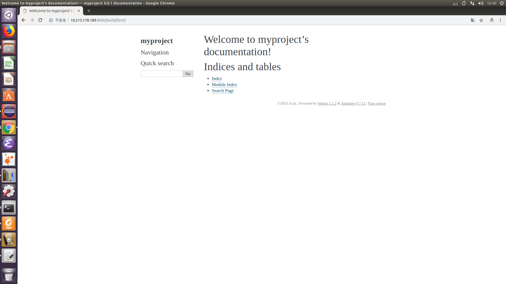
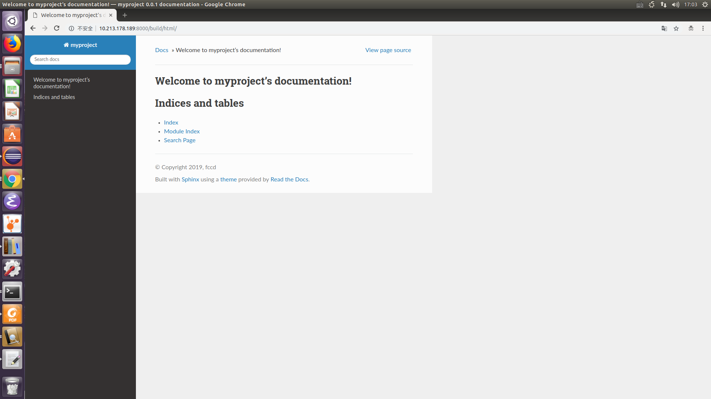
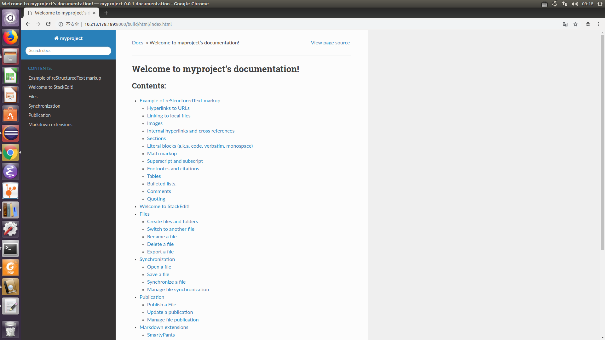

.. _write_the_doc:

01 write_the_doc
==========================================

:Author: RYefccd
:Date: 2019-08-08T08:26:11.588674+08:00

文档环境及其依赖
-----------------------------------------

.. code-block:: shell

   pip install sphinx

quickstart
-------------------------------------------

.. code-block:: shell

   (sphinx) ubuntu@pytorch:~/sphinx$ sphinx-quickstart demo/
   Welcome to the Sphinx 2.1.2 quickstart utility.

   Please enter values for the following settings (just press Enter to
   accept a default value, if one is given in brackets).

   Selected root path: demo/

   You have two options for placing the build directory for Sphinx output.
   Either, you use a directory "_build" within the root path, or you separate
   "source" and "build" directories within the root path.
   > Separate source and build directories (y/n) [n]: y

   The project name will occur in several places in the built documentation.
   > Project name: myproject
   > Author name(s): fccd
   > Project release []: 0.0.1

   If the documents are to be written in a language other than English,
   you can select a language here by its language code. Sphinx will then
   translate text that it generates into that language.

   For a list of supported codes, see
   https://www.sphinx-doc.org/en/master/usage/configuration.html#confval-language.
   > Project language [en]: 

   Creating file demo/source/conf.py.
   Creating file demo/source/index.rst.
   Creating file demo/Makefile.
   Creating file demo/make.bat.

   Finished: An initial directory structure has been created.

   You should now populate your master file demo/source/index.rst and create other documentation
   source files. Use the Makefile to build the docs, like so:
      make builder
   where "builder" is one of the supported builders, e.g. html, latex or linkcheck.

   (sphinx) ubuntu@pytorch:~/sphinx$ ls demo/
   Makefile  build  make.bat  source

   (sphinx) ubuntu@pytorch:~/sphinx/demo$ make html
   Running Sphinx v2.1.2
   loading pickled environment... done
   building [mo]: targets for 0 po files that are out of date
   building [html]: targets for 0 source files that are out of date
   updating environment: 0 added, 0 changed, 0 removed
   looking for now-outdated files... none found
   no targets are out of date.
   build succeeded.

   The HTML pages are in build/html.

初始配置
-------------------------------------------

.. literalinclude:: examples/init_sphinx_conf.py
   :language: python
   :linenos:
   :caption: conf.py
   :name: conf.py

修改配置
-------------------------------------------

read the doc 风格文档
^^^^^^^^^^^^^^^^^^^^^^^^^^^^^^^^^^^^^^^^^^^

依赖:

.. code-block:: shell

   pip install sphinx-rtd-theme

修改配置:

.. literalinclude:: examples/final_conf.py
   :language: python
   :lines: 67-72
   :linenos:
   :emphasize-lines: 6

支持 markdown 格式
^^^^^^^^^^^^^^^^^^^^^^^^^^^^^^^^^^^^^^^^^^^

sphinx 默认支持 restructureText 格式, 如果需要支持 markdown 格式, 需要导入依赖和修改相关配置.

依赖:

.. code-block:: shell

   pip install recommonmark

.. literalinclude:: examples/final_conf.py
   :language: python
   :lines: 31-35
   :linenos:
   :emphasize-lines: 4,5

支持ipynb(notebook)文件格式
^^^^^^^^^^^^^^^^^^^^^^^^^^^^^^^^^^^^^^^^^^^
感谢胡达聪提供协助

依赖:

.. code-block:: shell

   pip install nbsphinx

.. literalinclude:: examples/final_conf.py
   :language: python
   :linenos:
   :lines: 42-48

支持中文搜索
^^^^^^^^^^^^^^^^^^^^^^^^^^^^^^^^^^^^^^^^^^^
感谢黄奇鹏提供配置

依赖:

.. code-block:: shell

   pip install jieba

.. literalinclude:: examples/final_conf.py
   :language: python
   :linenos:
   :lines: 28-29 
   :emphasize-lines: 2

autobuild
^^^^^^^^^^^^^^^^^^^^^^^^^^^^^^^^^^^^^^^^^^^

在撰写文档时, 每次想要看到效果都要执行 make html 才能看到渲染的 html 文档. 为了能够
提升编辑文档的效率, 建议使用 autobuild 扩展. 一旦我们修改相关的文档和 conf.py 配置时,
就会自动触发构建. 感谢曹佳豪提供此技巧分享.     

依赖:

.. code-block:: shell

   pip install sphinx-autobuild

使用:

.. code-block:: shell

   sphinx-autobuild source build/html -H 0.0.0.0 -p 8000
   最后在 http://localhost:8000 访问即可.

或者把这个放在 Makefile 中:

.. literalinclude:: ../Makefile
   :language: shell
   :lines: 14-16
   :linenos:
   :caption: Makefile
   :name: Makefile

.. code-block:: shell

   make livehtml

日常撰写文档流程
-------------------------------------------

1. 开启自动文档构建

   .. code-block:: shell

      sphinx-autobuild source build/html -p 8000 -H 0.0.0.0
      # 或者
      make livehtml  # 参见上面的 Makefile 配置

#. 撰写文档

   .. code-block:: shell

      (sphinx) ubuntu@pytorch:~/sphinx/demo$ touch source/restructText_demo.rst
      (sphinx) ubuntu@pytorch:~/sphinx/demo$ touch source/markdown_StackEdit.md
       ...
      (sphinx) ubuntu@pytorch:~/sphinx/demo$ tree -l 2 .
      .
      ├── Makefile
      ├── make.bat
      └── source
          ├── _static
          ├── _templates
          ├── birthday-paradox.png
          ├── conf.py
          ├── index.rst
          ├── markdown_StackEdit.md
          └── restructText_demo.rst

#. 保存(crtl+s)触发自动构建

#. 在 http://localhost:8000/ 查看文档即可.

文档展示
-------------------------------------------

rst 语法参考: https://3vshej.cn/rstSyntax/index.html

个人笔记:  https://write-docs.readthedocs.io/en/latest/index.html

python-cookbook: https://python-cookbook-3rd-edition.readthedocs.io/zh_CN/latest/

